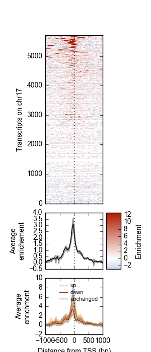
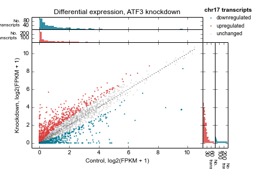

Metaseq
=======

Briefly, the goal of `metaseq` is to tie together lots of existing software into
a framework for exploring genomic data.  It focuses on flexibility and
interactive exploration and plotting of disparate genomic data sets.

The main documentation for `metaseq` can be found at http://packages.python.org/metaseq/.

.. image:: https://travis-ci.org/daler/metaseq.svg?branch=master
    :target: https://travis-ci.org/daler/metaseq

Example 1: Average ChIP-seq signal over promoters
-------------------------------------------------
There are multiple ways of viewing this example, depending on how you are
viewing this document:

* Latest release version on PyPI: `Example 1 <https://pythonhosted.org/metaseq/example_session.html>`_
* Reading this on GitHub? See `Example 1 <doc/source/example_session.rst>`_.
* IPython notebook: View on `nbviewer <http://nbviewer.ipython.org/github/daler/metaseq/blob/master/doc/source/example_session.ipynb?create=1>`_
* Compiled Sphinx docs: :ref:`[relative link within this documentation] <example_session>`,

    Top: Heatmap of ATF3 ChIP-seq signal over transcription start sites (TSS) on
    chr17 in human K562 cells.  Middle: average ChIP enrichment over all TSSs
    +/- 1kb, with 95% CI band.  Bottom: Integration with ATF3 knockdown RNA-seq
    results, showing differential enrichment over transcripts that went up,
    down, or were unchanged upon ATF3 knockdown.

Example 2: Differential expression scatterplots
-----------------------------------------------
There are multiple ways of viewing this example, depending on how you are
viewing this document.

* Latest release version on PyPI: `Example 2 <https://pythonhosted.org/metaseq/example_session_2.html>`_
* Reading this on GitHub? See `Example 2 <doc/source/example_session_2.rst>`_.
* IPython notebook: View on `nbviewer <http://nbviewer.ipython.org/github/daler/metaseq/blob/master/doc/source/example_session_2.ipynb?create=1>`_
* Compiled Sphinx docs: :ref:`[relative link within this documentation] <example_session_2>`,

    Control vs knockdown expression (log2(FPKM + 1)) for an ATF3 knockdown
    experiment.  Each point represents one transcript on chromosome 17.
    Marginal distributions are shown on top and side.  1:1 line shown as
    a dotted line.  Up- and downregulated genes determined by a simple 2-fold
    cutoff.

Other features
--------------
In addition, `metaseq` offers:

* A format-agnostic API for accessing "genomic signal" that allows you to work
  with BAM, BED, VCF, GTF, GFF, bigBed, and bigWig using the same API.

* Parallel data access from the file formats mentioned above

* "Mini-browsers", zoomable and pannable Python-only  figures that show genomic
  signal and gene models and are spawned by clicking on features of interest

* A wrapper around pandas.DataFrames to simplify the manipulation and plotting
  of tabular results data that contain gene information (like DESeq results
  tables)

* Integrates data keyed by genomic interval (think BAM or BED files) with data
  keyed by gene ID (e.g., Cufflinks or DESeq results tables)

Check out the `full documentation <http://packages.python.org/metaseq/>`_ for
more.
