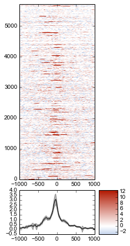
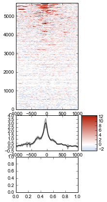
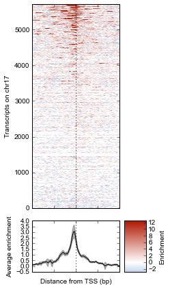

Example: Average ChIP-seq signal over promoters
===============================================

This example demonstrates the use of :mod:`metaseq` for performing a
common task when analyzing ChIP-seq data: what is the average signal
over transcription start sites (TSS) throughout the genome?

The IPython Notebook of this example can be found in the source
directory (`doc/source/example_session.ipynb`) or at
http://nbviewer.ipython.org/github/daler/metaseq/blob/v0.5dev/doc/source/example\_session.ipynb

.. code:: python

    # Enable in-line plots for this example
    %matplotlib inline
Example data
------------

This example uses data that can be downloaded and prepared by running
the `download_metaseq_example_data.py` script included with
`metaseq`. This will download human cell line data from the ENCODE
project, Ensembl, and GEO, and will prepare small test data files that
only use data from chromosome 17.

This section shows how to get the TSS +/- 1kb surrounding all
transcripts on chr17 from the example GTF file. It also shows how to
easily access the example data. If you have your own data you’d like to
work with, then you can skip to the next section.

.. code:: python

    # ---------------------------------------------------------
    # Get example filenames
    #
    from metaseq.helpers import example_filename
    
    # ATF3 ChIP-seq data in K562 cells, chr17 only
    ip_filename = example_filename('wgEncodeHaibTfbsK562Atf3V0416101AlnRep1_chr17.bam')
    
    # Input chromatin for K562 cells, chr17 only.
    input_filename = example_filename('wgEncodeHaibTfbsK562RxlchV0416101AlnRep1_chr17.bam')

The `metaseq` example data includes a GTF file of annotations for
chromosome 17. As part of the data download process, it was converted
into a `gffutils` database. We can use that database in order to
create TSS +/- 1kb for all transcripts.

.. code:: python

    # ---------------------------------------------------------
    # Get TSS +/- 1kb for all annotated transcripts on chr17.
    #
    import os
    import gffutils
    import pybedtools
    from pybedtools.featurefuncs import TSS
    from gffutils.helpers import asinterval
    
    db = gffutils.FeatureDB(example_filename('Homo_sapiens.GRCh37.66_chr17.gtf.db'))
    
    # Here we only create if needed, caching to disk.
    if not os.path.exists('tsses.gtf'):
        def tss_generator():
                """
                Generator function to yield TSS +/- 1kb of each annotated transcript
                """
                for transcript in db.features_of_type('transcript'):
                    yield TSS(asinterval(transcript), upstream=1000, downstream=1000)
    
        # A BedTool made out of a generator, and saved to file.
        tsses = pybedtools.BedTool(tss_generator()).saveas('tsses.gtf')

Creating the arrays
-------------------

metaseq works with the concepts of signal and windows. In this example,
the signal is ChIP data, and the windows are TSS +/- 1kb.

The first step is to create “genomic signal” objects out of the data.
Since our example files are BAM files, we specify the kind=’bam’, but if
you have your own data in a different format (bigWig, bigBed, BED, GFF,
GTF, VCF) then specify that format instead (see
:func:`metaseq.genomic_signal()`).

.. code:: python

    # ---------------------------------------------------------
    # Create genomic_signal objects that point to data files
    #
    import metaseq
    ip_signal = metaseq.genomic_signal(ip_filename, 'bam')
    input_signal = metaseq.genomic_signal(input_filename, 'bam')
Next we need the windows to use. The GTF file of TSSs we created above
is called `tsses.gtf`, and we can connect to it like this (again,
provide your own path as needed):

.. code:: python

    # ---------------------------------------------------------
    # The windows we'll get signal over
    
    tsses = pybedtools.BedTool('tsses.gtf')
Now we can create the arrays of signal over each window. Since this can
be a time-consuming step, the first time this code is run it will cache
the arrays on disk. The next time this code is run, it will be quickly
loaded. Trigger a re-run by deleting the `.npz` file.

Here, with the :meth:`BamSignal.array` method, we bin each promoter
region into 100 bins, and calculate the signal in parallel across as
many CPUs as are available. We do this for the IP signal and input
signals separately. Then, since these are BAM files of mapped reads, we
scale the arrays to the library size. The scaled arrays are then saved
to disk, along with the windows that were used to create them.

.. code:: python

    # ---------------------------------------------------------
    # Create arrays in parallel, and save to disk for later
    
    from metaseq import persistence
    import multiprocessing
    processes = multiprocessing.cpu_count()
    
    if not os.path.exists('example.npz'):
    
        # Create arrays in parallel
        ip_array = ip_signal.array(tsses, bins=100, processes=processes)
        input_array = input_signal.array(tsses, bins=100, processes=processes)
    
        # Normalize to library size
        ip_array /= ip_signal.mapped_read_count() / 1e6
        input_array /= input_signal.mapped_read_count() / 1e6
    
        # Cache to disk (will be saved as "example.npz" and "example.features")
        persistence.save_features_and_arrays(
            features=tsses,
            arrays={'ip': ip_array, 'input': input_array},
            prefix='example',
            link_features=True,
            overwrite=True)
        
Now that we’ve saved to disk, we can load the data:

.. code:: python

    # ---------------------------------------------------------
    # Load the windows and arrays
    
    features, arrays = persistence.load_features_and_arrays(prefix='example')

Let’s do some double-checks.

.. code:: python

    # ---------------------------------------------------------
    # Sanity-checks
    
    assert len(features) == 5708  # how many features?
    assert sorted(arrays.keys()) == ['input', 'ip']  # `arrays` acts like a dictionary
    assert arrays['ip'].shape == (5708, 100)  # one row per feature, and one column per bin
    assert arrays['ip'].shape == arrays['input'].shape

Plotting
--------

Now that we have NumPy arrays of signal over windows, there’s a lot we
can do. One easy thing is to simply plot the mean signal of IP and of
input. Let’s construct meaningful values for the x-axis, from -1000 to
+1000 over 100 bins:

.. code:: python

    # ---------------------------------------------------------
    # Create a meaningful x-axis
    
    import numpy as np
    x = np.linspace(-1000, 1000, 100)

Then plot:

.. code:: python

    # ---------------------------------------------------------
    # Initial plot of average signal over TSSs
    
    from matplotlib import pyplot as plt
    
    fig = plt.figure()
    ax = fig.add_subplot(111)
    
    ax.plot(x, arrays['ip'].mean(axis=0), color='r', label='IP')
    ax.plot(x, arrays['input'].mean(axis=0), color='k', label='input')
    
    # Add a vertical line at the TSS
    ax.axvline(0, linestyle=':', color='k')
    
    # Add labels and legend
    ax.set_xlabel('Distance from TSS (bp)')
    ax.set_ylabel('Average read coverage (per million mapped reads)')
    ax.legend(loc='best');

.. image:: example_session_files/example_session_19_0.png

Let's work on improving this plot, one step at a time. First, let's
create a single normalized array by subtracting input from IP:

.. code:: python

    # ---------------------------------------------------------
    # Normalize IP to the control
    
    normalized_subtracted = arrays['ip'] - arrays['input']
We don't really know if this average signal is due to a handful of
really strong peaks, or if it's moderate signal over many peaks. So one
improvement would be to include a heatmap of the signal over all the
TSSs. `metaseq` comes with some helper functions to simplify this kind
of plotting. The :func:`metaseq.plotutils.imshow` function is one of
these; here the arguments are described:

.. code:: python

    # ---------------------------------------------------------
    # First version of a plot that includes a heatmap of the array
    
    plt.rcParams['font.family'] = 'Arial'
    plt.rcParams['font.size'] = 10
    
    fig = metaseq.plotutils.imshow(
        # The array to plot
        normalized_subtracted,
        
        # X-axis to use
        x=x,
        
        # Change the default figure size to something smaller for these docs
        figsize=(3, 7),
        
        # Make the colorbar limits go from 5th to 99th percentile. 
        # `percentile=True` means treat vmin/vmax as percentiles rather than
        # actual values.
        vmin=5, vmax=99,  percentile=True,
        
        # Style for the average line plot
        line_kwargs=dict(color='k', label='All'),
        
        # Style for the +/- 95% CI band surrounding the average line
        fill_kwargs=dict(color='k', alpha=0.3),
    )

The array is not very meaningful as currently sorted. We can adjust the
sorting this either by re-ordering the array before plotting, or using
the `sort_by` kwarg when calling :func:`metaseq.plotutils.imshow`.

.. code:: python

    # ---------------------------------------------------------
    # Same plot, but add a meaningful sort order
    
    fig = metaseq.plotutils.imshow(
        # These are the same arguments as above.
        normalized_subtracted,
        x=x,
        figsize=(3, 7),
        vmin=5, vmax=99,  percentile=True,
        line_kwargs=dict(color='k', label='All'),
        fill_kwargs=dict(color='k', alpha=0.3),
        
        # Additionally, sort by mean signal
        sort_by=normalized_subtracted.mean(axis=1)
    )

.. image:: example_session_files/example_session_25_0.png

Now we'll make some tweaks to the plot. The figure returned by
:func:`metaseq.plotutils.imshow` has attributes `array_axes`,
`line_axes`, and `cax`, which can be used as an easy way to get
handles to the axes for further configuration. Let's make some
additional tweaks:

.. code:: python

    # ---------------------------------------------------------
    # Label axes, add dotted lines indicating TSS
    
    fig.line_axes.set_ylabel('Average enrichment');
    fig.line_axes.set_xlabel('Distance from TSS (bp)');
    
    fig.array_axes.set_ylabel('Transcripts on chr17')
    fig.array_axes.set_xticklabels([])
    
    fig.array_axes.axvline(0, linestyle=':', color='k')
    fig.line_axes.axvline(0, linestyle=':', color='k')
    
    fig

.. image:: example_session_files/example_session_27_0.png

Integrating with expression data
--------------------------------

`metaseq` also comes with example data from ATF3 knockdown
experiments. We will use them to subset the ChIP signal by those TSSs
that were affected by knockdown and those that were not. For this
example, we'll use a simple 2-fold cutoff to identify transcripts that
went up, down, or were unchanged upon ATF3 knockdown.

.. code:: python

    # ---------------------------------------------------------
    # Get filenames for example data
    
    control_filename = example_filename('GSM847565_SL2585.table')
    knockdown_filename = example_filename('GSM847566_SL2592.table')
.. code:: python

    # ---------------------------------------------------------
    # Create ResultsTable objects out of example data
    
    from metaseq.results_table import ResultsTable
    
    control = ResultsTable(control_filename, import_kwargs=dict(index_col=0))
    knockdown = ResultsTable(knockdown_filename, import_kwargs=dict(index_col=0))

:class:`metaseq.results_table.ResultsTable` objects are wrappers
around `pandas.DataFrame` objects. The `DataFrame` object is always
available as the `data` attribute. Here are the first 5 rows of the
`control` object, which show that the index is `id`, which are
Ensembl transcript IDs, and there are two columns, `score` and
`fpkm`:

.. code:: python

    # ---------------------------------------------------------
    # Inspect results to see what we're working with
    
    print len(control.data)
    control.data.head()

.. parsed-literal::

    85699

.. raw:: html

    

    <table border="1" class="dataframe">
      <thead>
        <tr style="text-align: right;">
          <th></th>
          <th>score</th>
          <th>fpkm</th>
        </tr>
        <tr>
          <th>id</th>
          <th></th>
          <th></th>
        </tr>
      </thead>
      <tbody>
        <tr>
          <th>ENST00000456328</th>
          <td> 108.293111</td>
          <td> 1.118336</td>
        </tr>
        <tr>
          <th>ENST00000515242</th>
          <td>  87.233019</td>
          <td> 0.830617</td>
        </tr>
        <tr>
          <th>ENST00000518655</th>
          <td> 175.175609</td>
          <td> 2.367682</td>
        </tr>
        <tr>
          <th>ENST00000473358</th>
          <td> 343.232679</td>
          <td> 9.795265</td>
        </tr>
        <tr>
          <th>ENST00000408384</th>
          <td>   0.000000</td>
          <td> 0.000000</td>
        </tr>
      </tbody>
    </table>
    
5 rows × 2 columns

    

We should ensure that `control` and `knockdown` have their
transcript IDs in the same order, and that they contain the transcripts
on chr17. The :meth:`ResultsTable.reindex_to` method is very useful
for this -- it takes a `pybedtools.BedTool` object and re-indexes the
underlying dataframe so that the order of the dataframe matches the
order of the features in the file.

We still have the `tsses` object that we used to create the array, and
we'll use that to re-index the dataframes. Let's look at a line from
that file to see how the transcript ID information is stored:

.. code:: python

    # ---------------------------------------------------------
    # Inspect the GTF file originally used to create the array
    
    print tsses[0]

.. parsed-literal::

    chr17	gffutils_derived	transcript	37025256	37027255	.	+	.	transcript_id "ENST00000318008"; gene_id "ENSG00000002834";
    

The Ensembl transcript ID is stored in the `transcript_id` field of
the GTF attributes, so we should let the
:meth:`ResultsTable.reindex_to` method know that:

.. code:: python

    # ---------------------------------------------------------
    # Re-align the ResultsTables to match the GTF file
    control = control.reindex_to(tsses, attribute='transcript_id')
    knockdown = knockdown.reindex_to(tsses, attribute='transcript_id')

.. code:: python

    # ---------------------------------------------------------
    # Sanity-checks
    
    # Everything should be the same length
    assert len(control.data) == len(knockdown.data) == len(tsses) == 5708
    
    # Spot-check some values to make sure the GTF file and the DataFrame match up.
    assert tsses[0]['transcript_id'] == control.data.index[0]
    assert tsses[100]['transcript_id'] == control.data.index[100]
    assert tsses[5000]['transcript_id'] == control.data.index[5000]

.. code:: python

    # ---------------------------------------------------------
    # Merge the control and knockdown data, and create a log2foldchange variable
    
    # Join the dataframes and create a new pandas.DataFrame.
    data = control.data.join(knockdown.data, lsuffix='_control', rsuffix='_knockdown')
    
    # Add a log2 fold change variable
    data['log2foldchange'] = np.log2(data.fpkm_knockdown / data.fpkm_control)
    data.head()

.. raw:: html

    

    <table border="1" class="dataframe">
      <thead>
        <tr style="text-align: right;">
          <th></th>
          <th>score_control</th>
          <th>fpkm_control</th>
          <th>score_knockdown</th>
          <th>fpkm_knockdown</th>
          <th>log2foldchange</th>
        </tr>
      </thead>
      <tbody>
        <tr>
          <th>ENST00000318008</th>
          <td> 433.958279</td>
          <td> 19.246250</td>
          <td> 386.088132</td>
          <td> 13.529179</td>
          <td>-0.508503</td>
        </tr>
        <tr>
          <th>ENST00000419929</th>
          <td>        NaN</td>
          <td>       NaN</td>
          <td>        NaN</td>
          <td>       NaN</td>
          <td>      NaN</td>
        </tr>
        <tr>
          <th>ENST00000433206</th>
          <td>  40.938322</td>
          <td>  0.328118</td>
          <td> 181.442415</td>
          <td>  2.517192</td>
          <td> 2.939529</td>
        </tr>
        <tr>
          <th>ENST00000435347</th>
          <td> 450.179142</td>
          <td> 21.655531</td>
          <td> 436.579186</td>
          <td> 19.617419</td>
          <td>-0.142600</td>
        </tr>
        <tr>
          <th>ENST00000443937</th>
          <td> 451.761068</td>
          <td> 21.905318</td>
          <td> 431.172759</td>
          <td> 18.859090</td>
          <td>-0.216021</td>
        </tr>
      </tbody>
    </table>
    
5 rows × 5 columns

    

.. code:: python

    # ---------------------------------------------------------
    # How many transcripts on chr17 changed expression?
    
    print "up:", sum(data.log2foldchange > 1)
    print "down:", sum(data.log2foldchange < -1)

.. parsed-literal::

    up: 735
    down: 514

In addition to the average coverage line, we'd like to add additional
lines in another axes panel. The :func:`metaseq.plotutils.imshow`
function is very flexible, and uses `matplotlib.gridspec` for
organizing the axes. We can ask for an additional axes by adding a new
entry to the `height_ratios` tuple:

.. code:: python

    # ---------------------------------------------------------
    # Add an additional axes to the heatmap figure
    
    fig = metaseq.plotutils.imshow(
        # Same as before...
        normalized_subtracted,
        x=x,
        figsize=(3, 7),
        vmin=5, vmax=99,  percentile=True,
        line_kwargs=dict(color='k', label='All'),
        fill_kwargs=dict(color='k', alpha=0.3),
        sort_by=normalized_subtracted.mean(axis=1),
        
        # Additionally specify height_ratios:
        height_ratios=(3, 1, 1)
    )
    
    # `fig.gs` contains the `matplotlib.gridspec.GridSpec` object,
    # so we can now create the new axes.
    bottom_axes = plt.subplot(fig.gs[2, 0])

The :func:`metaseq.plotutils.ci_plot` function takes an array and
plots the mean signal +/- 95% CI bands.

.. code:: python

    # ---------------------------------------------------------
    # Add average signal for different classes of transcripts to the new axes
    
    
    # Signal over TSSs of transcripts that were activated upon knockdown.
    metaseq.plotutils.ci_plot(
        x,
        normalized_subtracted[(data.log2foldchange > 1).values, :],
        line_kwargs=dict(color='#fe9829', label='up'),
        fill_kwargs=dict(color='#fe9829', alpha=0.3),
        ax=bottom_axes)
    
    # Signal over TSSs of transcripts that were repressed upon knockdown
    metaseq.plotutils.ci_plot(
        x,
        normalized_subtracted[(data.log2foldchange < -1).values, :],
        line_kwargs=dict(color='#8e3104', label='down'),
        fill_kwargs=dict(color='#8e3104', alpha=0.3),
        ax=bottom_axes)
    
    # Signal over TSSs tof transcripts that did not change upon knockdown
    metaseq.plotutils.ci_plot(
        x,
        normalized_subtracted[((data.log2foldchange > -1) & (data.log2foldchange < 1)).values, :],
        line_kwargs=dict(color='.5', label='unchanged'),
        fill_kwargs=dict(color='.5', alpha=0.3),
        ax=bottom_axes)
    
    # Clean up redundant x tick labels, and add axes labels
    fig.line_axes.set_xticklabels([])
    fig.array_axes.set_xticklabels([])
    fig.line_axes.set_ylabel('Average\nenrichement')
    fig.array_axes.set_ylabel('Transcripts on chr17')
    bottom_axes.set_ylabel('Average\nenrichment')
    bottom_axes.set_xlabel('Distance from TSS (bp)')
    fig.cax.set_ylabel('Enrichment')
    
    # Add the vertical lines for TSS position to all axes
    for ax in [fig.line_axes, fig.array_axes, bottom_axes]:
        ax.axvline(0, linestyle=':', color='k')
    
    # Nice legend
    bottom_axes.legend(loc='best', frameon=False, fontsize=8, labelspacing=.3, handletextpad=0.2)
    fig.subplots_adjust(left=0.3, right=0.8, bottom=0.05)
    fig.savefig('demo.png')
    fig

It appears that transcripts unchanged by ATF3 knockdown have the
strongest ChIP signal. Transcripts that went up upon knockdown (that is,
ATF3 normally represses them) had a slightly higher signal than those
transcripts that went down (normally activated by ATF3).

Interestingly, even though we used a crude cutoff of 2-fold for a single
replicate, and we only looked at chr17, the direction of the
relationship we see here -- where ATF3-repressed genes have a higher
signal than ATF3-activated -- is consistent with ATF3's known repressive
role.
