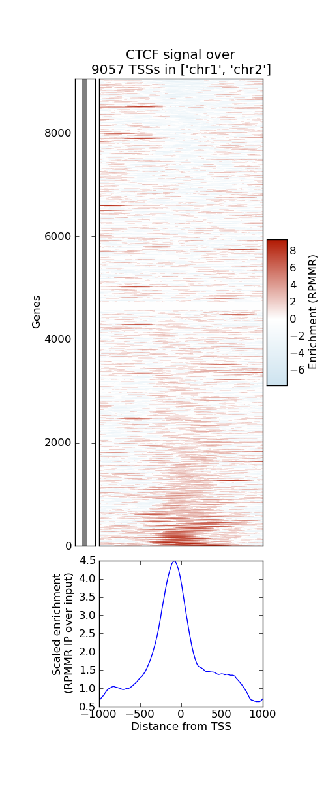
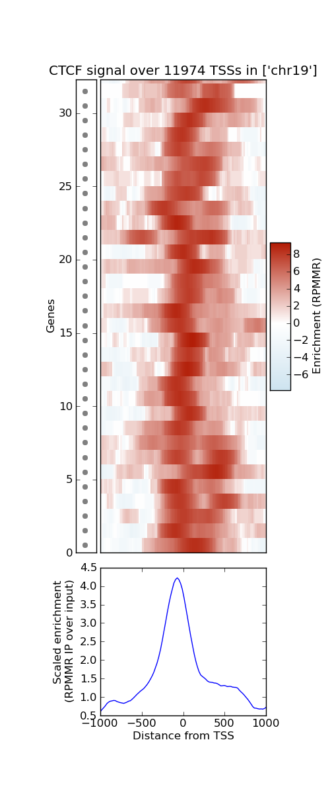
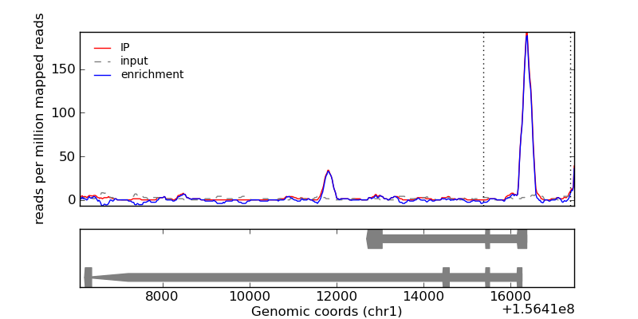
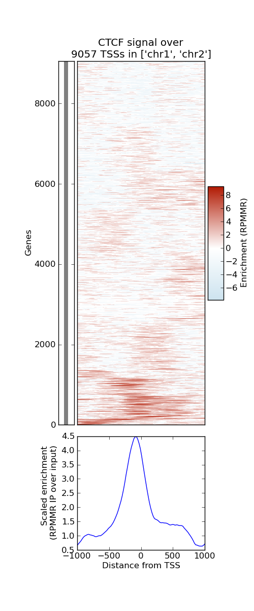
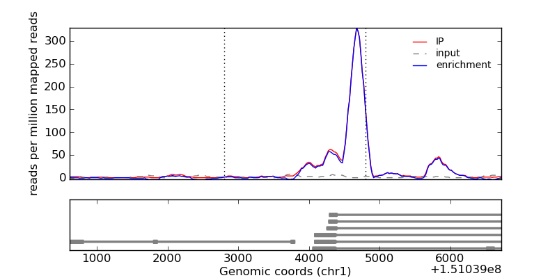

.. _CTCF example:

CTCF example
------------
The following example highlights the part of :mod:`metaseq` that deals with
ChIP-seq data and demonstrates the "mini-browser" functionality.  The images
below can be generated using the included example script, `ctcf_peaks.py` (in
the :file:`scripts/examples` directory; see :file:`test/data/download_data.py`
to download data from ENCODE).  This script:

* extracts the gene-level TSSs of the 9000 genes on human chromosomes 1 and 2
* creates features that extend 1kb upstream and downstream from each TSS
* using a BAM file, computes the coverage for each of those features in the IP
  into 100 bins (resulting in a 9057 x 100 matrix)
* does the same thing for the input
* scales input and IP by the number of mapped reads, then subtracts input from
  IP, resulting in a new matrix that represents IP enrichment in reads per
  million mapped reads (RPMMR)
* runs the TIP algorithm from Cheng et al (2011) Bioinformatics 2001 27:3221
* sorts features by the TIP zscores
* plots the sorted matrix along with the average signal
* plots a "strip" of dots along the left side (see below for more on this).

This runs in ~30s, but most of the time is spent counting the number of reads
in a call to ``samtools``.  Conveniently, the read counts are cached in files
next to the BAM files, so running the script again takes ~8s.  Here's the
figure:

This plot can be panned and zoomed; zooming in to the top-scoring TSSs shows
this:

Note that on the left-hand side we can now see individual dots corresponding to
each feature's row.  Clicking on one of these dots spawns a mini-browser for
just that feature and any surrounding features, showing both IP, input, and the
difference:

Instead of sorting by TIP zscores, we can optionally cluster the matrix using
MiniBatch k-means as implemented in scikits.learn -- this still takes ~8s to
run:

Zooming in, we can inspect individual features in the bottom cluster, which
contains "distantly upstream" peaks:

.. image:: images/ctcf-figure-zoom-2.png
    :width: 500px

Of course, things aren't always nice and clean; here's an example where there
is strong signal upstream of the gene on the left, but it's also in the first
intron of the gene on the right:

This kind of interactive exploration of the data usually leads to improved
analyses -- perhaps it would be interesting to ignore features that are
overlapping (most likely by using :mod:`pybedtools`, which is tightly
integrated with :mod:`metaseq`) or perhaps only looking at cases where TSSs of
different genes are nearby.  It is simple to investigate these options --
simply provide a new set of features to get a new plot.  Using the provided
script, extending the window upstream or downstream is also trivial.

